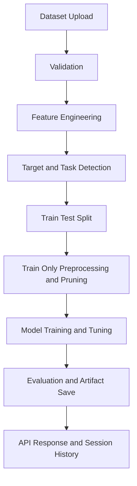

<p align="center">
    
</p>

<p align="center">
    
</p>

<p align="center">
    
    
    
    
    
</p>

Most ML projects fail before modeling starts.
Not because algorithms are weak, but because data pipelines are inconsistent, target detection is brittle, and evaluation leaks trust.

This repository is built to close that gap: an API-first AutoML system that takes raw tabular data to reproducible model artifacts with guardrails at every critical stage.

<table>
    <tr>
        <td><strong>Ingestion</strong><br/>CSV/XLSX/XLS upload with session tracking</td>
        <td><strong>Intelligence</strong><br/>Target detection and train-only preprocessing guards</td>
        <td><strong>Delivery</strong><br/>Model artifacts, metrics, and API-first output</td>
    </tr>
</table>

---

## Why This Project Exists

Teams often face the same friction:

- dataset ingestion changes from file to file,
- preprocessing logic is not reusable,
- model comparison is hard to reproduce,
- output artifacts are scattered and difficult to audit.

The result is slow iteration and low confidence in model quality.

---

## Problem -> Friction -> Solution -> Impact

| Stage | Reality | What This Project Does | Impact |
|---|---|---|---|
| Problem | Manual, inconsistent tabular ML workflows | API-driven standardized pipeline | Faster setup and cleaner handoffs |
| Friction | Hidden leakage and weak validation | Train-only preprocessing + target checks + overlap guards | More reliable evaluation |
| Solution | Need one backend for data, models, and artifacts | FastAPI + session artifacts + AutoML training + agent flow | End-to-end automation with traceability |
| Impact | Hard to scale experimentation | Reproducible baseline runner and model serialization | Repeatable benchmarking and deployment readiness |

---

## Solution Overview

AutoML Agnetic AI is a backend platform that:

- ingests CSV/Excel datasets,
- performs feature engineering and data transformation,
- detects target/problem type,
- trains and tunes multiple ML models,
- exposes EDA, Q&A, and dashboard generation through APIs,
- stores all outputs in session-scoped artifacts.

---

## Workflow Diagram



---

## What Makes This Different

- Leakage-aware design in training path (train-only transformations and pruning).
- Session-based artifact tracking for reproducibility.
- Unified API surface for upload, EDA, training, Q&A, and dashboards.
- Works for both classification and regression with shared operational flow.
- Baseline runner to benchmark pipeline behavior consistently.

---

## Features

- Multi-format ingestion: CSV, XLSX, XLS.
- Automated feature engineering.
- EDA report generation.
- AutoML model training with hyperparameter search.
- LangGraph-driven end-to-end agent execution.
- Natural-language dataset Q&A.
- Interactive dashboard chart payload generation.
- Session history endpoint for artifact audit.

---

## Under the Hood

| Layer | Implementation |
|---|---|
| API | FastAPI, Uvicorn |
| Data | pandas, NumPy |
| ML | scikit-learn, XGBoost, LightGBM, CatBoost |
| Agent/LLM | LangChain, LangGraph, Groq, Google GenAI |
| Visualization | ydata-profiling, Plotly, Matplotlib, Seaborn |
| Artifacts | joblib, session folder structure |

Model families used:

- Classification: Logistic Regression, Decision Tree, KNN, optional heavier ensembles.
- Regression: Linear Regression, Ridge, Lasso, ElasticNet, optional heavier ensembles.

Why this mix:

- strong linear baselines for interpretability,
- non-linear capacity when needed,
- robust comparison via tuned search and evaluation metrics.

---

## Project Workflow (Step-by-step)

1. Upload dataset via API.
2. Validate file type, size, and minimum schema.
3. Generate engineered dataset and session artifacts.
4. Detect target and task type.
5. Build train/test split and apply train-only preprocessing.
6. Tune and train candidate models.
7. Return ranked metrics and persist model artifacts.

---

## Installation

```bash
git clone https://github.com/Mayuresh-Bairagi/automl_Agnetic_AI.git
cd automl_Agnetic_AI
pip install -r requirements.txt
```

Create `.env`:

```env
GROQ_API_KEY=your_groq_key
GOOGLE_API_KEY=your_google_key
LLM_PROVIDER=groq
```

---

## Usage

Run the API:

```bash
uvicorn app.main:app --host 0.0.0.0 --port 8000
```

Recommended endpoint order:

1. `POST /upload`
2. `POST /eda` (optional)
3. `POST /ml-models`
4. `GET /session/{session_id}/history`

Core endpoint map:

| Endpoint | Method | Purpose |
|---|---|---|
| `/upload` | POST | Ingest dataset and create session artifacts |
| `/eda` | POST | Generate EDA report |
| `/ml-models` | POST | Train and evaluate models |
| `/agent/run` | POST | Execute full agent pipeline |
| `/chat` | POST | Q&A over dataset |
| `/dashboard/charts` | POST | Build chart payloads |
| `/session/{session_id}/history` | GET | Retrieve artifact timeline |

Reproducible baseline benchmarking:

```bash
python src/evaluation/baseline_runner.py --session-id <session_id> --target-col <target> --problem-type classification --cv 2 --max-rows 3000
python src/evaluation/baseline_runner.py --session-id <session_id> --target-col <target> --problem-type regression --cv 2 --max-rows 3000
```

---

## Results / Output

Each run can produce:

- ranked per-model metrics,
- serialized model files (`.joblib`),
- preprocessing artifact (`preprocessing.joblib`),
- session-level metadata and file history.

Evaluation metrics:

- Classification: Accuracy, Balanced Accuracy, F1, Precision, Recall, ROC-AUC.
- Regression: R2, MAE, RMSE.

---

## Where It Can Break

- Rare classes can fail stratified splitting.
- Weak target selection can reduce model validity.
- Data drift can degrade performance after deployment.
- Missing environment keys can block LLM-dependent steps.

These are known boundaries and should be monitored in production.

---

## Future Direction

- CI/CD quality gates with benchmark thresholds.
- Automated drift and data-quality monitoring.
- Extended explainability reports.
- Containerized deployment templates.
- Wider integration and regression test coverage.

---

## Author

Mayuresh Bairagi

---

This project is not just a model trainer; it is a reliability-first ML delivery backbone designed to turn experimentation into repeatable engineering outcomes.
