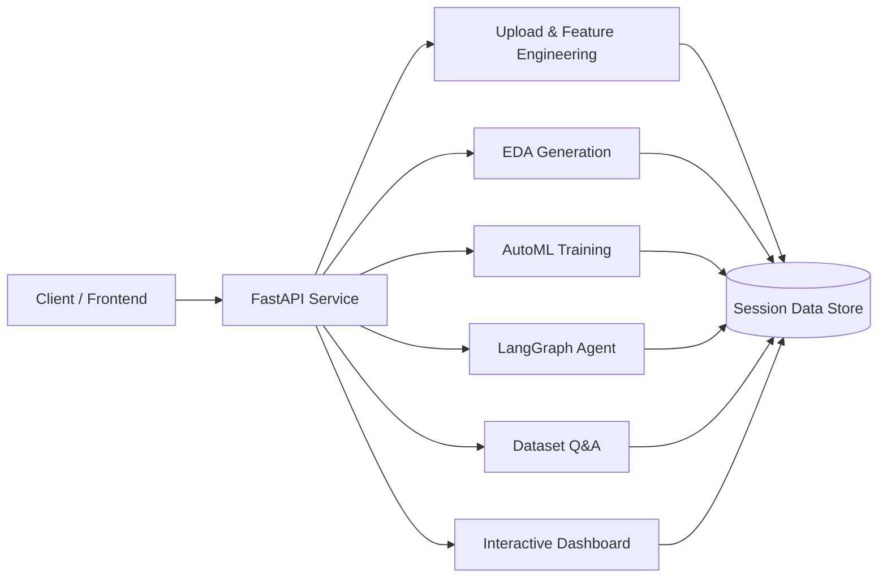
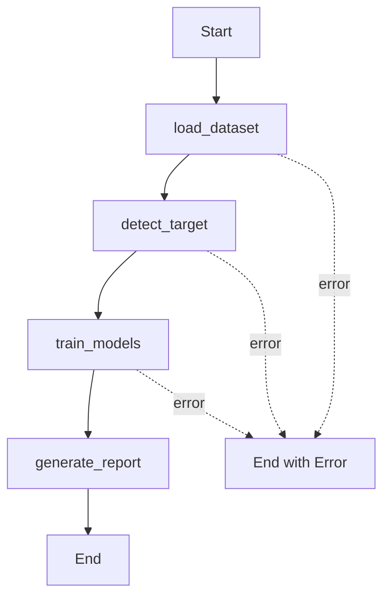

# AutoML Agnetic AI


Production-ready AutoML backend that transforms raw tabular datasets into actionable machine learning outcomes: feature engineering, EDA, model training, agentic orchestration, and natural-language dataset Q&A.

## 📌 Project Details

| Field | Value |
|---|---|
| Project Name | **AutoML Agnetic AI** |
| Package | `auto_ml_model` |
| Author | Mayuresh Bairagi |
| Primary Stack | FastAPI, Scikit-learn, LangChain, LangGraph |

## ✨ Core Capabilities

- Dataset upload with validation (`.csv`, `.xlsx`, `.xls`)
- Automated feature engineering and type conversions
- EDA report generation using `ydata-profiling`
- AutoML model training for **classification** and **regression**
- Agentic end-to-end workflow orchestration using LangGraph
- Natural-language dataset Q&A with sandboxed pandas execution
- Interactive dashboard chart specification generation

## 🏗️ System Architecture



## 🔄 Agent Pipeline (LangGraph)



## 🚀 Quick Start

### 1) Clone and install

```bash
git clone https://github.com/Mayuresh-Bairagi/automl_Agnetic_AI.git
cd automl_Agnetic_AI
pip install -r requirements.txt
```

### 2) Configure environment variables

Create a `.env` file in the project root:

```env
GROQ_API_KEY=your_groq_key
GOOGLE_API_KEY=your_google_key
LLM_PROVIDER=groq
```

If you prefer Gemini, use:

```env
LLM_PROVIDER=google
# Optional: keep this true to auto-fallback to Groq on Gemini quota/rate-limit errors
GOOGLE_FALLBACK_TO_GROQ=true
```

### 3) Run the API

```bash
python app/main.py
```

Or run directly with Uvicorn:

```bash
uvicorn app.main:app --host 0.0.0.0 --port 8000
```

## 🧩 API Endpoints

| Endpoint | Method | Description |
|---|---|---|
| `/` | GET | Health check |
| `/upload` | POST | Upload dataset and generate processed session data |
| `/eda` | POST | Generate EDA HTML report URL |
| `/ml-models` | POST | Train ML models and return metrics |
| `/agent/run` | POST | Execute end-to-end AutoML agent pipeline |
| `/chat` | POST | Ask natural-language questions about dataset |
| `/dashboard/charts` | POST | Generate Plotly chart payloads |

## 📦 Key Dependencies

| Category | Packages |
|---|---|
| API | `fastapi`, `uvicorn`, `python-multipart` |
| Data & ML | `pandas`, `numpy`, `scikit-learn`, `xgboost`, `lightgbm`, `catboost`, `pycaret` |
| Visualization | `matplotlib`, `seaborn`, `plotly`, `ydata-profiling` |
| LLM & Agentic | `langchain`, `langchain_community`, `langchain_google_genai`, `langchain_groq`, `langgraph` |
| Utilities | `joblib`, `openpyxl`, `structlog`, `python-dotenv` |

## 🧪 Development Notes

- Current repository does not include a formal test suite configuration.
- Recommended next step: add unit tests for API request/response validation and pipeline components.

## 🛠️ Troubleshooting

- **Gemini returns `429 RESOURCE_EXHAUSTED`**: this indicates Google quota/billing is exhausted or unavailable for your project/model.
  - Verify Gemini billing/quota in Google AI Studio / GCP.
  - Set `LLM_PROVIDER=groq` for immediate continuity.
  - Or keep `LLM_PROVIDER=google` and set `GOOGLE_FALLBACK_TO_GROQ=true` with `GROQ_API_KEY` configured to auto-fallback.

## 📄 License

No license file is currently present in the repository. Add a `LICENSE` file to define usage terms.
