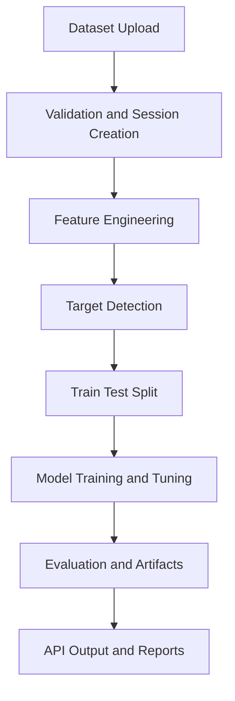
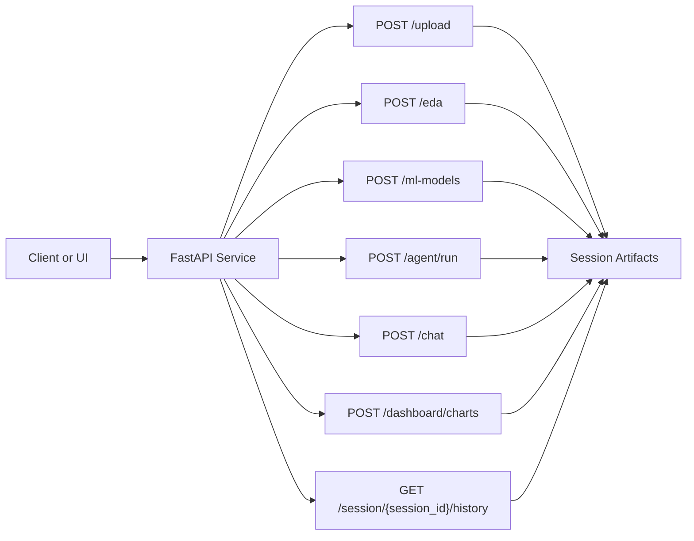

<div align="center">

# AutoML Agnetic AI

FastAPI-based AutoML platform for tabular data with automated preprocessing, model training, EDA, and agent-driven analytics.


</div>

---

> [!TIP]
> Minimal GitHub-native styling is used so this README looks clean in both dark and light themes.

## Highlights

| Area | Value |
|---|---|
| API | FastAPI endpoints for upload, EDA, training, agent run, Q&A, dashboard |
| ML | Classification + regression with model comparison and tuning |
| Data Ops | Session-based artifact tracking and reproducible baseline runner |
| Reliability | Leakage-aware preprocessing and validation guards |

## Problem Statement
- Building reliable ML pipelines from raw business data is slow and error-prone.
- Teams need a reusable system that can ingest datasets, clean and engineer features, train models, and serve interpretable outputs quickly.

## Solution Overview
- This project provides an end-to-end AutoML backend with session-based artifact tracking.
- It combines rule-based preprocessing with LLM-assisted target understanding, then trains multiple ML models for classification or regression.
- It exposes everything through API endpoints for upload, EDA, model training, Q&A, dashboard generation, and pipeline orchestration.

## Workflow Diagram


## System Architecture Diagram


## Features
- Multi-format dataset ingestion: CSV, XLSX, XLS.
- Automated feature engineering and preprocessing artifact persistence.
- Model training for both classification and regression tasks.
- Hyperparameter tuning and comparative model scoring.
- EDA report generation and interactive chart payload generation.
- LangGraph-based agent pipeline for end-to-end automation.
- Natural-language dataset Q&A with generated pandas logic.
- Session-level history endpoint for traceability.

## Tech Stack
- Backend: FastAPI, Uvicorn
- ML: scikit-learn, XGBoost, LightGBM, CatBoost
- Data: pandas, NumPy
- LLM/Agent: LangChain, LangGraph, Groq, Google GenAI
- Visualization: ydata-profiling, Plotly, Matplotlib, Seaborn
- Utilities: joblib, python-dotenv, structlog

## Project Workflow (Step-by-step)
1. Data ingestion via API upload endpoint.
2. Dataset validation (size, format, schema constraints).
3. Feature engineering and processed dataset generation.
4. Target variable detection and problem-type selection.
5. Leakage-safe split and preprocessing fit on training data.
6. Multi-model training with hyperparameter search.
7. Evaluation, ranking, model serialization, and response output.

## Installation
1. Clone repository.
2. Install dependencies.
3. Configure environment variables.

```bash
git clone https://github.com/Mayuresh-Bairagi/automl_Agnetic_AI.git
cd automl_Agnetic_AI
pip install -r requirements.txt
```

Create a .env file:
```env
GROQ_API_KEY=your_groq_key
GOOGLE_API_KEY=your_google_key
LLM_PROVIDER=groq
```

## Usage
Run API server:

```bash
uvicorn app.main:app --host 0.0.0.0 --port 8000
```

Core API flow:
1. POST /upload
2. POST /eda (optional)
3. POST /ml-models
4. GET /session/{session_id}/history

Primary endpoints:

| Endpoint | Method | Purpose |
|---|---|---|
| /upload | POST | Ingest dataset and create session artifacts |
| /eda | POST | Generate EDA HTML report |
| /ml-models | POST | Train and evaluate ML models |
| /agent/run | POST | Execute end-to-end AutoML agent |
| /chat | POST | Natural-language Q&A on dataset |
| /dashboard/charts | POST | Generate chart payloads |
| /session/{session_id}/history | GET | Return session artifact history |

Optional reproducible baseline run:

```bash
python src/evaluation/baseline_runner.py --session-id <session_id> --target-col <target> --problem-type classification --cv 2 --max-rows 3000
python src/evaluation/baseline_runner.py --session-id <session_id> --target-col <target> --problem-type regression --cv 2 --max-rows 3000
```

## Model Details
- Classification models: Logistic Regression, Decision Tree, KNN, and optional heavier ensemble models.
- Regression models: Linear Regression, Ridge, Lasso, ElasticNet, and optional heavier ensemble models.
- Selection rationale:
    - Mix of interpretable linear baselines and non-linear learners.
    - Hyperparameter tuning improves generalization.
    - Balanced-accuracy aware scoring for class-imbalance robustness.

## Results / Output
- Outputs include:
    - Ranked model metrics table
    - Serialized model files (.joblib)
    - Preprocessing artifact (.joblib)
    - Session-level metadata and history
- Typical evaluation metrics:
    - Classification: Accuracy, Balanced Accuracy, F1, Precision, Recall, ROC-AUC
    - Regression: R2, MAE, RMSE

## Future Improvements
- Add CI/CD with automated benchmark gates.
- Expand drift monitoring and data-quality alerts.
- Add richer model explainability reports.
- Add Docker and deployment templates.
- Add broader unit and integration test coverage.

## Author
Mayuresh Bairagi
