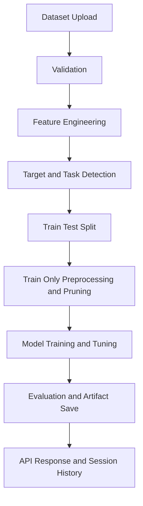

<p align="center">
    
</p>

<p align="center">
    
</p>

<p align="center">
    
    
    
    
    
</p>

Most tabular ML projects fail before model selection.
The failure points are usually inconsistent preprocessing, fragile target detection, and leakage-prone evaluation.

AutoML Agnetic AI is designed to solve that end-to-end with an API-first backend that turns raw tabular files into reproducible metrics and deployable artifacts.

---

## Table of Contents

- [What This Project Solves](#what-this-project-solves)
- [Core Capabilities](#core-capabilities)
- [System Workflow](#system-workflow)
- [Architecture Snapshot](#architecture-snapshot)
- [Repository Structure](#repository-structure)
- [Getting Started](#getting-started)
- [Configuration](#configuration)
- [Run the API](#run-the-api)
- [API Endpoints](#api-endpoints)
- [Artifacts and Reproducibility](#artifacts-and-reproducibility)
- [Baseline Benchmarking](#baseline-benchmarking)
- [Testing](#testing)
- [Known Boundaries](#known-boundaries)
- [Troubleshooting](#troubleshooting)
- [Roadmap](#roadmap)

---

## What This Project Solves

Common pain points in real ML delivery:

- Dataset ingestion behavior changes with each file.
- Feature engineering is hard to audit and hard to reuse.
- Train and test paths diverge, causing leakage risk.
- Model comparison outputs are inconsistent and difficult to reproduce.
- Artifact handoff to downstream consumers is incomplete.

What this repository provides:

- A standardized FastAPI workflow for upload, preprocessing, training, and analytics.
- Session-scoped artifact tracking under one session ID.
- Leakage-aware training path with train-only transformations.
- Reproducible outputs for both classification and regression use cases.

---

## Core Capabilities

- Multi-format ingestion: CSV, XLSX, XLS.
- Automatic feature engineering at upload time.
- EDA report generation via ydata-profiling.
- Automated target and problem-type handling.
- Model training with hyperparameter search and comparative metrics.
- LangGraph-powered full pipeline orchestration.
- Natural-language dataset Q and A with generated code traces.
- Interactive chart payload generation for dashboards.
- Session history endpoint for traceability and audit.
- Downloadable per-model usage package for local inference.

---

## System Workflow



---

## Architecture Snapshot

| Layer | Tools |
|---|---|
| API | FastAPI, Uvicorn |
| Data | pandas, NumPy |
| Modeling | scikit-learn, XGBoost, LightGBM, CatBoost |
| Agent Orchestration | LangChain, LangGraph |
| LLM Providers | Groq, Google GenAI |
| Visual Analytics | ydata-profiling, Plotly, Matplotlib, Seaborn |
| Artifacts | joblib + session folder versioning |

Model families currently used:

- Classification: Logistic Regression, Decision Tree, KNN, optional heavier models.
- Regression: Linear Regression, Ridge, Lasso, ElasticNet, optional heavier models.

---

## Repository Structure

```text
app/
  main.py                        # FastAPI application and endpoint definitions
src/
  agent/automl_agent.py          # LangGraph orchestration
  Classifier/MLClassifier.py     # Classification training path
  Regression/regression.py       # Regression training path
  dataCleaning/featureEngineering01.py
  data_dashboard/eda.py
  data_dashboard/interactive_dashboard.py
  data_qa/dataset_qa.py
  evaluation/baseline_runner.py
  inference/usage_package.py
  session_tracking/preprocessing_tracker.py
model/
  models.py                      # Pydantic request/response models
config/
  config.yml                     # Runtime configuration
data/datasetAnalysis/
  session_id_.../                # Session-scoped artifacts
tests/
  test_pipeline_integrity.py
  test_inference_tracking_endpoints.py
```

---

## Getting Started

### 1) Clone and install

```bash
git clone https://github.com/Mayuresh-Bairagi/automl_Agnetic_AI.git
cd automl_Agnetic_AI
python -m venv .venv
. .venv/Scripts/activate
pip install -r requirements.txt
```

For Unix-like shells:

```bash
source .venv/bin/activate
```

### 2) Optional editable install

```bash
pip install -e .
```

---

## Configuration

Create a `.env` file at project root:

```env
GROQ_API_KEY=your_groq_key
GOOGLE_API_KEY=your_google_key
LLM_PROVIDER=groq
```

Notes:

- Some pipeline paths run without LLM calls, but LLM-dependent features require valid keys.
- If both providers are configured, provider selection is controlled by `LLM_PROVIDER`.

---

## Run the API

```bash
uvicorn app.main:app --host 0.0.0.0 --port 8000 --reload
```

- Swagger UI: http://127.0.0.1:8000/docs
- Redoc: http://127.0.0.1:8000/redoc
- Static session artifacts: http://127.0.0.1:8000/data

Recommended endpoint execution order:

1. POST /upload
2. POST /eda (optional)
3. POST /ml-models
4. GET /session/{session_id}/history

---

## API Endpoints

### Health Check

- GET /
- Returns service readiness payload.

### Upload and Feature Engineering

- POST /upload
- Accepts multipart file upload.
- Supported formats: .csv, .xlsx, .xls
- Current constraints:
  - max file size: 50 MB
  - minimum rows: 10
  - minimum columns: 2

Example:

```bash
curl -X POST "http://127.0.0.1:8000/upload" \
  -H "accept: application/json" \
  -H "Content-Type: multipart/form-data" \
  -F "file=@data/Data_Train.csv"
```

Expected response highlights:

- filename
- shape
- preview (first rows)
- session_id

### EDA Report

- POST /eda
- Body:

```json
{
  "session_id": "session_id_20260328_122933_6f197b7c"
}
```

- Returns a public URL under /data/{session_id}/index.html.

### Train Models

- POST /ml-models
- Body:

```json
{
  "session_id": "session_id_20260328_122933_6f197b7c",
  "problem_statement": "Predict sales from available predictors"
}
```

Response includes:

- problem_type
- target_variable
- results (ranked metrics)
- best_model_summary
- recommended_model and download links
- model_paths and usage_script_paths
- preprocessing_validation report

### Run Full Agent Pipeline

- POST /agent/run
- Body:

```json
{
  "session_id": "session_id_20260328_122933_6f197b7c",
  "problem_statement": "Predict customer churn"
}
```

- Executes a LangGraph flow and returns consolidated result metadata.

### Dataset Q and A

- POST /chat
- Body:

```json
{
  "session_id": "session_id_20260328_122933_6f197b7c",
  "question": "What is the average income by segment?"
}
```

- Returns answer, generated code, and optional error field.

### Dashboard Charts

- POST /dashboard/charts
- Body:

```json
{
  "session_id": "session_id_20260328_122933_6f197b7c",
  "chart_types": ["distribution", "correlation", "scatter"]
}
```

If chart_types is null, the backend returns a curated chart set.

### Download Per-model Usage Package

- GET /model-usage-script/{session_id}/{model_file_name}
- Returns a ZIP that includes model usage instructions, script template, and supporting assets.
- model_file_name must end with .joblib and cannot be preprocessing.joblib.

### Validate Preprocessing Artifact

- GET /session/{session_id}/preprocessing/validate
- Returns both non-strict and strict preprocessing validation payloads.

### Session History

- GET /session/{session_id}/history
- Returns consolidated artifact history for timeline and audit use cases.

---

## Artifacts and Reproducibility

Each run writes artifacts under:

```text
data/datasetAnalysis/<session_id>/
```

Typical files:

- raw_file.csv
- processed_file.csv
- preprocessing.joblib
- one or more trained model .joblib files
- index.html (when EDA is generated)

Reproducibility design choices:

- Session ID ties all artifacts and metadata together.
- Train-only preprocessing is persisted for inference consistency.
- Model outputs include downloadable usage package links.

---

## Baseline Benchmarking

Use the baseline runner for quick, reproducible comparisons:

```bash
python src/evaluation/baseline_runner.py --session-id <session_id> --target-col <target> --problem-type classification --cv 2 --max-rows 3000
python src/evaluation/baseline_runner.py --session-id <session_id> --target-col <target> --problem-type regression --cv 2 --max-rows 3000
```

---

## Testing

Run tests from project root:

```bash
pytest -q
```

Focused examples:

```bash
pytest tests/test_pipeline_integrity.py -q
pytest tests/test_inference_tracking_endpoints.py -q
```

---

## Known Boundaries

- Rare classes can break stratified splitting.
- Incorrect target semantics can degrade output quality.
- Data drift after deployment can reduce model performance.
- Missing API keys can block LLM-dependent functionality.

These should be monitored in production with data and model quality checks.

---

## Troubleshooting

- Upload returns 413:
  - Input file exceeds current 50 MB upload limit.
- Upload returns 422:
  - Dataset does not meet minimum size constraints.
- Training returns target validation error:
  - Confirm your problem statement and inspect target column type/values.
- LLM-related calls fail or rate-limit:
  - Verify .env keys, provider choice, and retry with reduced request load.
- Missing preprocessing artifact validation:
  - Call the validation endpoint and retrain if strict consistency fails.

---

## Roadmap

- CI gates using benchmark thresholds.
- Built-in drift and data quality monitors.
- Stronger explainability and model cards.
- Containerized deployment templates.
- Expanded API and integration test coverage.

---

## Author

Mayuresh Bairagi

---

AutoML Agnetic AI is not only a model trainer. It is a reliability-first ML backend designed to convert experimentation into repeatable engineering outcomes.
